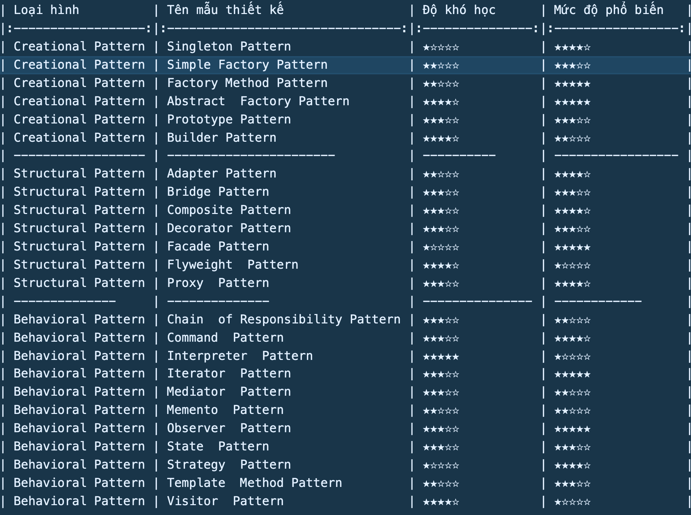

# Design Patterns in TS

## FAQ

#### Question 1

Mục đích tạo ra nó dùng để làm gì ?

#### Question 2

Nó sinh ra để giải quyết vấn đề gì ? (CS và LT)

#### Question 3

Ứng dụng nó vào thực tiếp như thế nào ? (CS và LT)

(Source: [Tips Javascript](https://www.youtube.com/c/TipsJavascript) )
